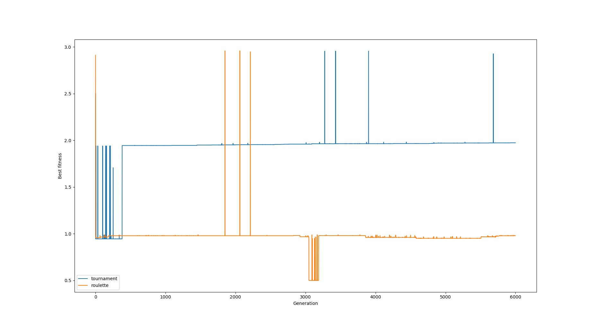
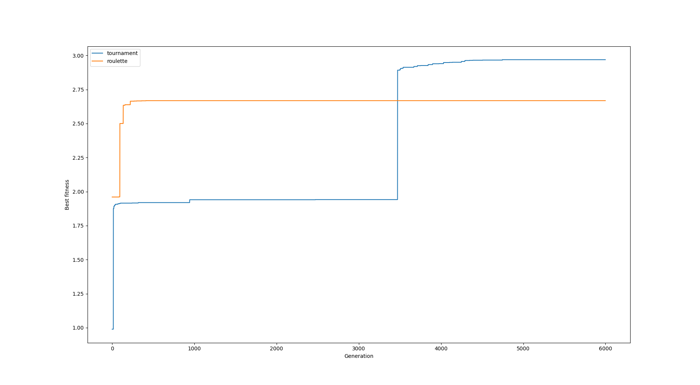
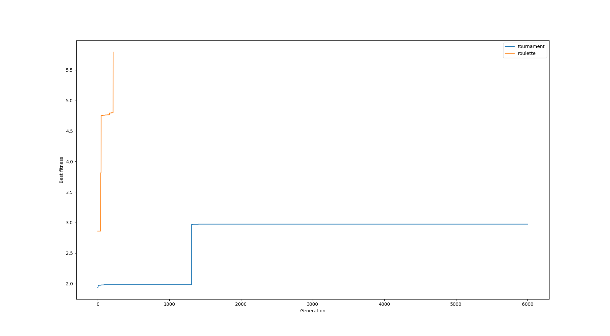
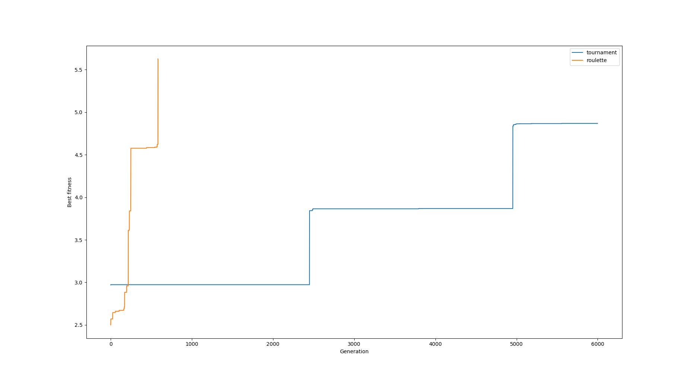
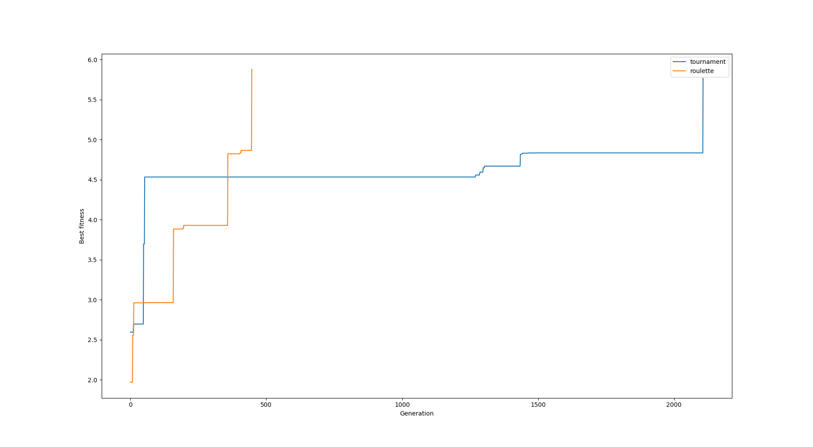
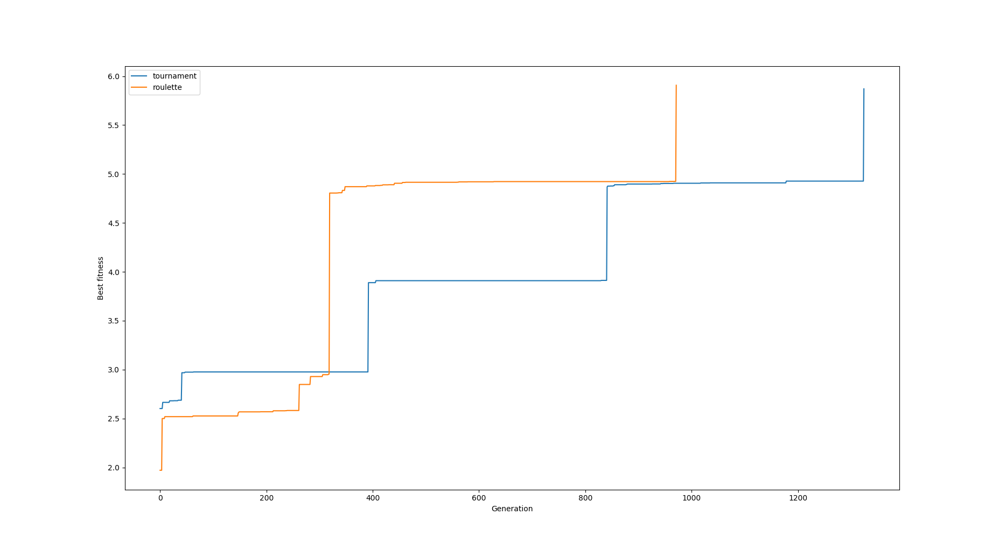

# Genetic algorithm project

The task is to evolve a program using genetic algorithm,
which stores instructions for navigating
hunter on map. The hunter is supposed to find as many treasures as possible.

## Dependencies

Install python3 and requirements with the help of `pip`
```
$ pip install -r requirements.txt
```

## Hunter's program

Program consists of 64 cells, each one storing one 8-bit instruction.
Each instruction consists of *instruction id* (first 2 bits) and
*instruction address* (last 6 bits)

Available instructions:
* Increment `00xxxxxx` - increments the cell at address `xxxxxx` by 1
* Decrement `01xxxxxx` - decrements the cell at address `xxxxxx` by 1
* Jump `10xxxxxx` - jump to address `xxxxxx`
* Move `11xxxxxx` - move the hunter according to number of ones (bits) in
cell with addr `xxxxxx`. 0-2 ones moves the hunter UP, 3-4 DOWN, 5-6 LEFT and
7-8 RIGHT

The virtual machine executes the given program. The program is stopped
when one of stopping conditions is met:
* The hunter collects all the treasures
* The hunter leaves the grid
* The machine executed 500 instructions

## My approach

### Initializing first generation

The first generation is being generated randomly. Each individual generates
first 16 instructions in range 0-255 and the rest (48 instructions) are left
empty. The number of individuals per generation can be controlled by
`consts.POPULATION_N` constant.

### Creating new generation

### Selection of parents

I implemented 2 types of selection - **tournament** and **roulette**. User
can choose which one will the program use. Both of them choose 2 parents.

#### Tournament

We pick randomly `n` individuals from the population and select the one
with the best fitness amongst them. The second parent cannot be the same
one, so we pick `n` individuals from the population without the first parent and
select the one with the best fitness once again.

#### Roulette

Each individual is assigned the following probability:


Parents are chosen according to their probabilities without replacement.

### Crossover

After picking 2 parents we perform crossover between them. We choose randomly
"crossover point" `x` (number in range 1-62). The child is created with the
first `x` instructions from the first parent and the rest with `n-x` instructions
from the second parent.

### Mutation

I implemented 2 types of mutation.
The mutation occurs at each cell with probabilities mentioned below.
* invert random bit - **1%**
* increment the cell by 1 - **0.1%**

### Elitarism

If set to `True`, we take `n` best individuals into next generation. Important
note: individuals do not mutate afterwards.

### Fitness

Each individual's program is ran in virtual machine. After that, we
compute fitness according to following formula
```
fitness = 1 + golds_found - (#steps * 0.001) - (out * 0.01)
```
where `out` is a boolean variable telling us whether the hunter left the grid.
Therefore, we prefer shorter programs and programs where hunter does not leave
the grid.

## Changing settings for the algorithm

You can change default settings in `consts.py` file.
* **MAX_GENERATIONS** - The maximum number of generations.
* **POPULATION_N** - The number of individuals within every generation.
* **TOURNAMENT_N** - The number of individuals being picked in tournament selection.
* **ELITARISM** - Boolean value indicating using elitarism.
* **ELITARISM_N** - The number of individuals passed into next generation
* **MAX_PROGRAM_STEPS** - The maximum number of steps virtual machine is able to do.

## Results

Let's look at the results and how I fine tuned the the code to perform better.
I've been testing it on map located in `map.txt` with 5 treasures.

### First runs

The first runs were done with 6000 generations, 30 individuals per generation, elitarism
turned off and every mutation had `0.1% * 0.5` chance to occur.
The hunter was able to find at most 3 treasures.



We can see that the best individuals die immediately and we loose some treasures.
So I used elitarism in all the other experiments. After turning the elitarsm
on the hunter sometimes found 4 treasures.



I increased the number of individuals in a populations to 100, which improved
the performance and the hunter occasionally collected all the treasures.



### Mutation improvement

In previous experiments, the second mutation was incrementing cell's address.
I tried to change it to increment entire cell value. The results stayed
approximately the [same](results/6000_100_mutating_cell.png).

People who study genetics think that mutation is responsible for improving
individuals, so I decided to increase the probability to 0.01 for inverting
random bit in each cell. This resulted in huge improvement.





## Conclusion

The overall results show roullete selection outperformed tournament. It has
been able to find final solutions more quickly (tested on several runs).
Also, elitarism and increase in number of individuals in population
proved my assumption and improved results significantly.
The final tuning on increasing the probability for the mutation inverting
random bit brought amazing results.

In the future, it would be interesting to try other types of selections,
mutations and crossovers and compare it to current results.
