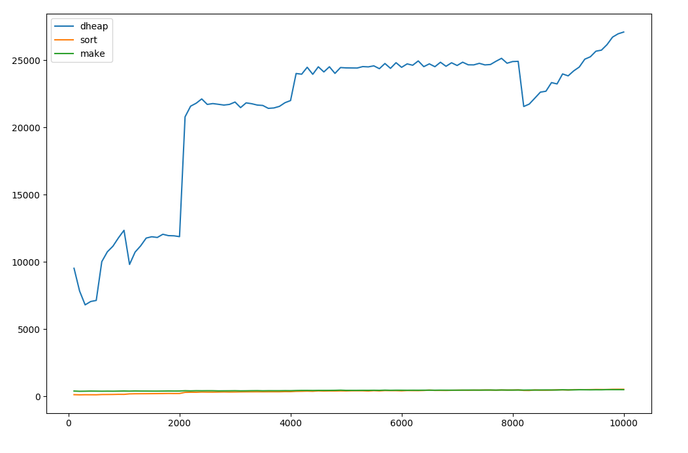

# DHeap

## Machine
* Lenovo Thinkpad E560
* Intel Core i7 6500U, 8GB RAM
* Ubuntu 16.04 LTS

## Testing different values for D (10000 numbers)

| D   | Time    |
| --- |:-------:|
| 2   | ~84000  |
| 3   | ~80000  |
| 4   | ~74000  |
| 5   | ~68000  |
| 6   | ~66000  |
| 7   | ~62000  |
| 8   | ~38000  |
| 9   | ~37000  |
| 10  | ~45000  |

## Results

Programs compiled using
```bash
g++ -std=c++11 -Wall -Werror -pedantic -O3 -march=native dheap.cpp -o dheap
```

**Testing against standard sort and make_heap + sort_heap**

Sorting numbers in range [100, 10000] with the step of 100.


