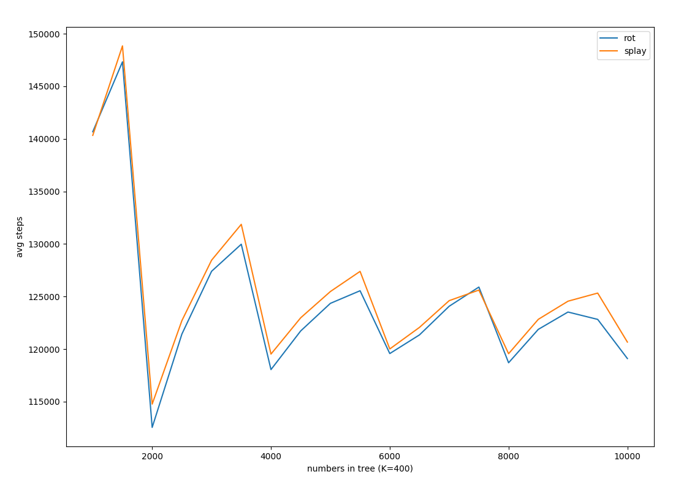

Splay tree
==========

*I had to run some tests A and B on small N, because it took too much time to get the result on higher N*

## Test A

## Test B

#### K = 200

#### K = 400

#### K = 600

#### K = 800

#### K = 1000

## Test C

#### D = 200

#### D = 400

#### D = 600

#### D = 800

#### D = 1000

